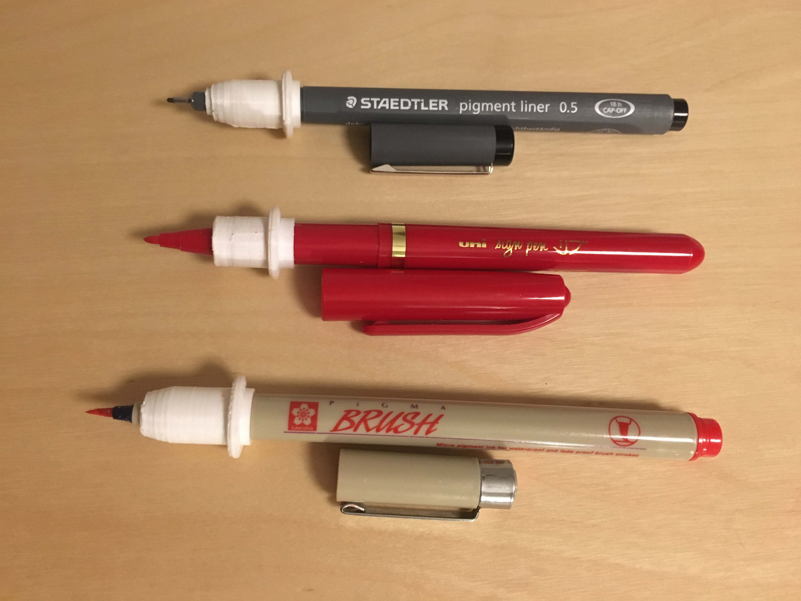

# 3D printable plotter adapters for pens and refills

Use your favorite contemporary pens with vintage HP plotters with this parametric OpenSCAD code to create custom adapters.

These adapters allow you to use pens or even directly refills with vintage HP plotters like the HP 7440A, HP 7550A, HP 7475A… and other vintage plotters using the same standard for pens.

This version was created to be quick and simple: **3 measures using a caliper, and in 5 minutes you are ready to print a new adapter** (printing itself will take maximum 20 minutes, depending on your settings and printer).

The goal was to be able to create an adapter for any random pen laying around or newly bought without thinking to much about it, trying and see what works best.

If you are interested in vintage plotters but don't know where to start, here's a list of ressources, manuals, articles, posts and artworks: [https://workflowy.com/s/Cl4.I8zutkIg5K](https://workflowy.com/s/Cl4.I8zutkIg5K)

You can also check the [#plottertwitter hashtag on Twitter](https://twitter.com/hashtag/plottertwitter).



## How to create your own adapter to use your favorite pen on your vintage HP plotter:

- Duplicate one of the existing OpenSCAD adapter files, for example `Staedtler pigment line plotter pen adapter.scad` (note that you'll need to keep the `plotter_pen_adapters_common.scad` file in the same folder as your new file, as it is imported by your adapter code)

- Select a stop-point near the tip of your pen. It is frequently the cap limit, but sometimes it more practical to use another narrowing along the body of the pen.

- Measure the maximum diameter of your pen above and below the chosen stop point, and add them to the `pen_top_diameter` (bigger) and `pen_bottom_diameter parameters` (smaller).

- Measure the distance from the tip (ie. the paper) to the stop-point, and add that value to `height_where_pen_diameter_change`.

Note: for proper measuring, it is easier and more precise to use a caliper.

Optionnally, you can also adjust :

- `diameter_spacing` Increase to have lower tolerances (more space) and make it easier to slide the pen in and out. Decrease to have higher tolerances (less space) and have a tigher fit for the pen.

- `top_cut_off_height` It can reasonably be adjusted between `total_body_height - 11.5` and `total_body_height - 0` (Full height of the top body. Longer printing time). If you cut below `total_body_height - 11.5` the grip might suffer (to be tested :-)

## 3D Printing

The printing shouldn't take more than 20 minutes, maybe less with a better printer that the low-cost (300€!) printer that was used to print the first adapters.

The main obstacle to properly printing these adapters is the flange (or band) around the adapter's body, which overhang.

You might very well be able to print it without support, but the first test were nicely successful by using the supports generated by Slic3r Prusa Edition (**not** on an Original Prusa i3). The supports were easy to remove, didn't add too much time and helped get a functionnal print.

You can use a very low infill. The first adapters were printed with a 10% cubic infill and are strong enough.

## This is based off:

- [Code from Sasha Kovar from a design by Brian Boucheron](https://www.thingiverse.com/thing:1261805/)
- [Code and measurements by Ed Nisley KE4ZNU April 2015](https://softsolder.com/2015/04/21/hp-7475a-plotter-oem-pen-body-model/) 

It differs and merge them in the following ways:

- the whole plotter HP pen model from Ed Nisley is used as a base. 
- then we substracts two cylinders. They are used as empty space for the target pen.
- The bottom cylinder is meant to be smaller than the top one, as most pens narrow before the tips.
-  The height where the pen diameter change is used as a parametric stop-point, set so the tip of the pen exactly touch the paper. 

It's also inspired by these other projects:

- [Full model of short and long plotter pens OpenSCAD file](https://www.thingiverse.com/thing:227985)

- [Ball pen insert adapter derived from the full models. STL file.](https://www.thingiverse.com/thing:762716)

## To do

- Emboss the reference or name of the pen around the pen adapter to avoid confusion when you have multiple adapters

- Add and test a tilt angle parameter to give a slight fixed angle to the tip when touching the paper. The maximum angle possible would need to be tested to avoid collisions. It might help in using highlighters or other asymetrical tips.